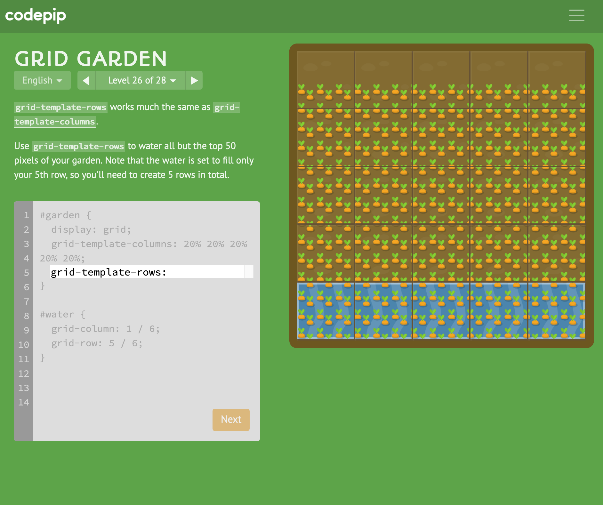

# 100 Days Of Code - Log

### Day 1: June 30, 2020
##### *HTML and CSS*

**Today's Progress:** Finished Tribute Page

**Thoughts:** Although I have been working in FreeCodeCamp for almost 10 days, I officially launched my 100 days today.  Starting to get hang of how CSS and HTML work.  Figured out how to do the CSS for a:hover for a class -- that was exciting.  Really need to figure out Git and GitHub, as well as CodePen and how they interact. It's quite difficult thosto find info on how to use the features.

**Link to Work:** [Tribute Page](https://codepen.io/bleudrift/pen/vYLWKxG)

**Helpful Links / Resources** 
* [Flexbox Froggy](https://flexboxfroggy.com/)

 

***

### Day 2: July 1, 2020
##### *Git, Github, Visual Studio Code, Some CSS*

**Today's Progress**: Watched several videos on Git and Github, and one on VSC.  Tried to set up Git on Mac. 

**Thoughts:** Trying to wrap head around how Git, Github, VSC, CodePen etc. work together. The info that's available online is inscrutable and usually assumes some prior knowledge.  Spent way too much time on this -- my head is spinning. Will leave for later. Did a little CSS.
 
 
***

### Day 3: July 2, 2020
##### *CSS Flexbox, CSS Grid*

**Today's Progress:**
Worked through Flexbox Froggy and the CSS Games. 
Did well on all of them except for this problem which I could not figure out:
 
 

**Thoughts:** 

**Helpful Links / Resources:**
* [Mastering Markdown in GitHub](https://guides.github.com/features/mastering-markdown/#examples)
* [Insert images into GitHub Readme - YouTube video by TanUv90](https://www.youtube.com/watch?v=hHbWF1Bvgf4)
* [Flexbox Froggy](https://flexboxfroggy.com/)
* [Grid Garden on Codepip](https://codepip.com/games/grid-garden/)
 

***

### Day 4: July 3, 2020
##### *CSS Animation, Survey form started*

**Today's Progress:**
Tried to code some graphics and animation on my own by looking at examples on Codepen. That didn't work too well, so I went back to Freecodecamp to follow the instructions and encountered some difficulty with that as well.  So, I stopped banging my head against the animation wall and started the next css project, the survey form, after finishing the tribute page project in Freecodecamp. Making some progress.
 
**Thoughts:** 
It's been a long day.

**Helpful Links / Resources:**
* nothing new

 

***

### Day 5: July 5, 2020
##### *Survey form continued*

**Today's Progress:**
Continuing to work on the survey form.  
 
**Thoughts:** 
I am deliberately taking longer to create the survey because I don't want to just throw in the HTML and CSS and move on the next project. I'm trying to understand a couple of things: how to work on the project - does one start in HTML and then flush out the CSS, or is by section?  Plus, I need to play around with the elements to see what they do, organize the page, abstract the flow, etc. Slowly getting there. 

**Helpful Links / Resources:**
* nothing new
 

***

### Day 6: July 6, 2020 - 55th birthday
##### *CSurvey form continued*

**Today's Progress:**
Survey form still in development - worked on background and added slider.
 
 
**Thoughts:** 
 Did a lot of googling and looking at other codepens to figure our how to do certain things... and that's okay. Actually, I think its a way of getting ahead.

**Helpful Links / Resources:**
* nothing new

 

***

### Day 7: July 7, 2020 
##### *Reviewed CSS descendents, inheritance, specificity. Started JavaScript*

**Today's Progress:**
Reviewed CSS descendents, inheritance, specificity by watching 28 Net Ninja CSS beginner videos.  Learned about child selectors.
 
 
**Thoughts:** 
 It was very useful to review and do. Things started to become a bit clearer in terms of inheritance, descendants, specificity, etc. Hopefully this will solve some of the problems in my survey.

**Helpful Links / Resources:**
* [Net Ninja CSS Beginner videos on inheritance, child selectors, etc.](https://www.youtube.com/watch?v=MlJrAhGVIis&list=PL4cUxeGkcC9gQeDH6xYhmO-db2mhoTSrT&index=16)

 

***

### Day 8: July 8, 2020 
##### *JavaScript*

**Today's Progress:**
Watched 14 Net Ninja videos on JavaScript - covered variables, mathemetical operators, booleans, if, else, comparison operators
 
 
**Thoughts:** 
Made sense, didn't seem that bad, but I wasn't applying it.  I did perform the same functions in VS Code as he did in the video and had to figure out why it didn't work several times -- had to delete stuff from Chrome, etc.  I really like the way Net Ninja presents and explains.

**Helpful Links / Resources:**
* [Net Ninja CSS Beginner video playlist for JavaScript](https://www.youtube.com/playlist?list=PL4cUxeGkcC9i9Ae2D9Ee1RvylH38dKuET)

 

***

### Day 9: July 9, 2020 
##### *JavaScript*

**Today's Progress:**
Watched more Net Ninja videos on JavaScript - covered logical operators, while loops, for loops, and started functions
 
 
**Thoughts:** 
Was a slow kinda day. Didn't feel like I covered a lot, but still made a wee bit of progress.  I surived to code another day.

**Helpful Links / Resources:**
* [Net Ninja CSS Beginner video playlist for JavaScript](https://www.youtube.com/playlist?list=PL4cUxeGkcC9i9Ae2D9Ee1RvylH38dKuET)

 

***

### Day 10: July 10, 2020 
##### *JavaScript*

**Today's Progress:**
Worked through 45 FreeCodeCamp JavaScript challenges
 
 
**Thoughts:** 
Really useful to do the challenge in Freecodecamp and then to run it in the chrom dev console -- the error messages there were somehow more focused and useful in helping me target where the problem was...

**Helpful Links / Resources:**
* None

 

***

### Day 11: July 11, 2020 
##### *JavaScript*

**Today's Progress:**
Worked through 20 FreeCodeCamp JavaScript challenges
 
 
**Thoughts:** 
Continued to challenge in Freecodecamp and then to run it in the chrom dev console -- 

**Helpful Links / Resources:**
* None

 

***

### Day 12: July 12, 2020 
##### *JavaScript*

**Today's Progress:**
Worked through 7 FreeCodeCamp JavaScript challenges
 
 
**Thoughts:** 
Continued to challenge in Freecodecamp and then to run it in the chrom dev console -- Couple minor things that are slowing me down are typos, missing brackets at end of if else; and most importantly, not slowing down to read the entire problem all the way through and think about it.  Saw this quote on a Quora response in the Quora code space:  “Programming is thinking not typing.”  And am starting to realize that how I think and approach problems needs to evolve.

**Helpful Links / Resources:**
* None

 

***

### Day 13: July 13, 2020 
##### *JavaScript*

**Today's Progress:**
Watched Net Ninja JavaScript Tutorial for Beginners - Episodes #21 - #27
 
 
**Thoughts:** 
Really think the Net Ninja series - digestible bits, great examples, and get to hear the vernacular. Other than that, not much progress. Today was a yucky day.

**Helpful Links / Resources:**
* [The Net Ninja JavaScript Tutorial for Beginners ](https://www.youtube.com/watch?v=qoSksQ4s_hg&list=PL4cUxeGkcC9i9Ae2D9Ee1RvylH38dKuET)

 

***

### Day 14: July 14, 2020 
##### *JavaScript*

**Today's Progress:**
Worked through 14 FreeCodeCamp JavaScript challenges
 
 
**Thoughts:** 
Completed 14 FreeCodeCamp JavaScript challenges & w/in striking distance of finishing basic JS. But am uncomfortable w/ competency level & need to supplement w/ examples & practice from other resources before finishing & moving on to the next series of FreeCodeCamp challenges, ES6.

**Helpful Links / Resources:**
* None

 

***

### Day 15: July 15, 2020 
##### *nothing - cognitive overload - Vanilla JS Podcast and JQuery YouTube Videos by Net Ninja*

**Today's Progress:**
Vanilla JS Podcast and JQuery YouTube Videos by Net Ninja
 
 

**Thoughts:** 
Experienced cognitive overload so took a break & listened to an engaging & informative @CodeNewbie podcast Vanilla JavaScript w/Chris Ferdinandi. Definitely learning Vanilla after basic JS. Then, inexplicably, watched several JQuery tutorial

**Helpful Links / Resources:**
* [CodeNewbie What is Vanilla JS Podcast](https://www.codenewbie.org/podcast/what-is-vanilla-js-and-how-can-it-help-you)
* [The Net Ninja JavaScript Tutorial for Beginners ](https://www.youtube.com/watch?v=qoSksQ4s_hg&list=PL4cUxeGkcC9i9Ae2D9Ee1RvylH38dKuET)

 

***

### Day 16: July 16, 2020 
##### *JavaScript*

**Today's Progress:**
Watched Net Ninja JavaScript Tutorial for Beginners - Episodes #26 - #34; Completed several FreeCodeCamp JS challenges, now up to 96 / 110.
 
 

**Thoughts:** 
Resumed watching JS tutorials & completing FreeCodeCamp challenges. Sometimes my mind turns off for challenge scenarios it doesn't find "engaging" like sorting cards and albums -- coding problem narcolespy.  But learning how to use JS to change html, css -- so cool 

**Helpful Links / Resources:**
* [The Net Ninja JavaScript Tutorial for Beginners ](https://www.youtube.com/watch?v=qoSksQ4s_hg&list=PL4cUxeGkcC9i9Ae2D9Ee1RvylH38dKuET)

 

***

### Day 17: July 17, 2020 
##### *JavaScript*

**Today's Progress:**
Nothing - worked on [ToolKit Curated List](https://github.com/GabeKelemen/100-days-of-code/blob/master/Toolkit.md)
 
 
**Thoughts:** 
Don't know if its the heat or friday, but all I did was work on my list.

**Helpful Links / Resources:**
* [ToolKit Curated List](https://github.com/GabeKelemen/100-days-of-code/blob/master/Toolkit.md)

 

***

### Day 18: July 18, 2020 
##### *JavaScript, ES6, CSS Selector Review*

**Today's Progress:**
8 FreeCodeCamp JavaScript Challenges (103/110); ES6 (3/31), 2 Podcasts, CSS Selector Practice on CSS Diner (27/32)
 
 
**Thoughts:** 
Tried to do a lot today. Got back into JS and complete a challenge that previously made no sense. Nested loops were a bit of a hick up until I checked out The Coding Train video and the light bulb went off. Hit recursion, check out the FreeCodeCamp intro link below -- it was much clearer in explaining than the content in the challenge. But, it may require subconscious percolation to really stick. Practiced CSS selectors in CSS Diner -- gamification is a useful tool.  It wasn't evident where the answers were for some of the practice items until I googled it. Overall a productive day.

**Helpful Links / Resources:**
* [CodeNewbie Podcast - Ali Spittel Developing Yourself and Your Code](https://www.codenewbie.org/podcast/how-do-you-develop-yourself-and-your-code-while-fighting-off-trolls)
* [CodeNewbie Podcast - Arianna Tobin on Ageism in Tech](https://www.codenewbie.org/podcast/what-does-ageism-in-tech-look-like)
* [CSS Diner](https://flukeout.github.io/)
* [The CodingTrain Nested Loops YouTube Video](https://www.youtube.com/watch?v=H7frvcAHXps&vl=en)
* [FreeCodeCamp Quick Intro to Recursion](https://www.freecodecamp.org/news/quick-intro-to-recursion/)

 

***
### Rest Day: July 19, 2020 

 

***

### Day 19: July 20, 2020 
##### *ES6, Object Oriented Programming*

**Today's Progress:**
5 ES6 (8/31), 26 Object Oriented Programming (26/26)
 
 
**Thoughts:** 
Freecodecamp finished Object Oriented Programming - came very easily, just made a lot of sense.

**Helpful Links / Resources:**
* None

 

***

### Day 20: July 21, 2020 
##### *ES6, Object Oriented Programming*

**Today's Progress:**
something
 
 
**Thoughts:** 
something

**Helpful Links / Resources:**
* [Web Development In 2020 - A Practical Guide by Traversy Media](https://www.youtube.com/watch?time_continue=164&v=0pThnRneDjw)
* [Web Dev Tech Mindmap by GabeK](https://coggle.it/diagram/XxcGX8ZTxnzqhpaS/t/-)

